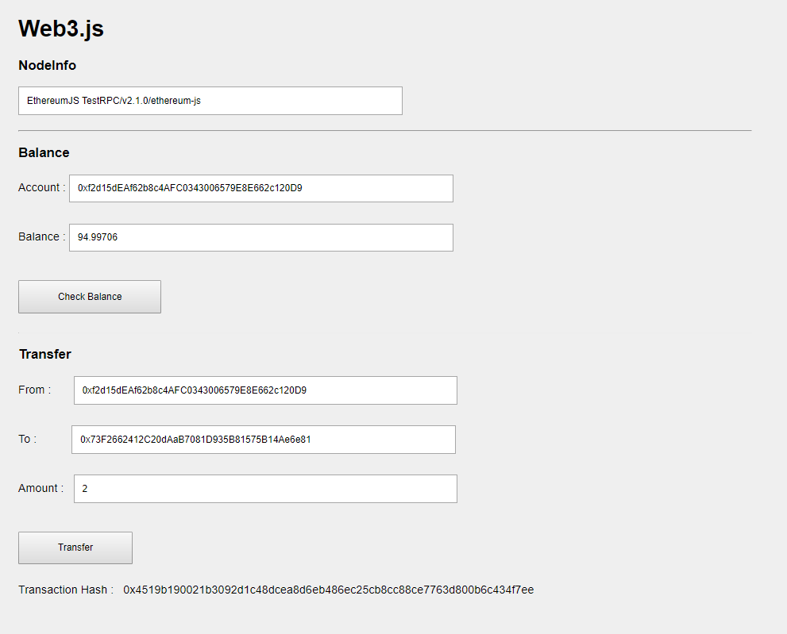

# Web3Js for Practice
this repository is used for web3.js priactice




## NodeInfo : 
  Get Ethereum Node Information

```
	web3.eth.getNodeInfo(function(error, result){
		if(error){
			console.log( "error" ,error);
		}
		else{
			console.log( "result",result );
					
		}
	});
```

## Balance : 
  Get account's Balance
  web3.eth.getAccounts : get account from Ethereum node
  web3.eth.getBalance  : get account's balance
  web3.utils.fromWei   : convert wei to ether

```
	web3.eth.getAccounts(function(error, accounts) {
		if(error) {
			console.log(error);
		}
		$('#Account').val(accounts[0]);
		web3.eth.getBalance(accounts[0]).then(function(result){
			console.log( "Balance : " ,web3.utils.fromWei(result, 'ether'));
			$('#Balance').val(web3.utils.fromWei(result, 'ether'));
		});
	});
```


## Transfer : 
   Transfer Ether from "From" to "To"

```
	var txnObject = {
			"from":_from,
			"to": _to,
			"value": web3.utils.toWei(_Amount,'ether'),
			// "gas": 21000,         (optional)
			// "gasPrice": 4500000,  (optional)
			// "data": 'For testing' (optional)
			// "nonce": 10           (optional)
	    }
			
		web3.eth.sendTransaction(txnObject, function(error, result){
			if(error){
				console.log( "Transaction error" ,error);
			}
			else{
				var txn_hash = result; //Get transaction hash
			}
		});
```